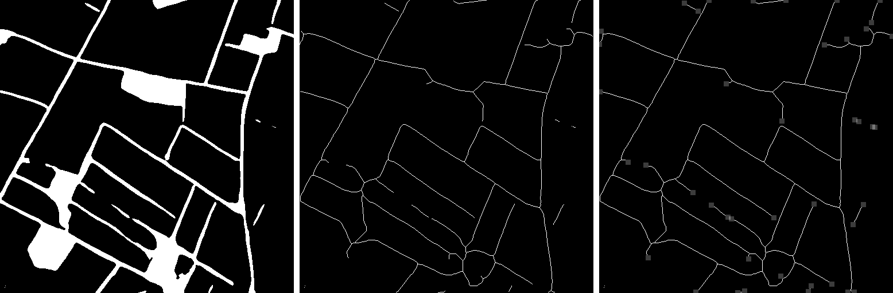

### GapLoss

 Implementation of GapLoss based on pytorch . There may be problems, welcome criticism and correction.

class GapLoss is the true loss function, class GapLoss_demonstration is the loss function for demonstration.

I tested a sample with the following results:

References:

1.  Yuan, W.; Xu, W. GapLoss: A Loss Function for Semantic Segmentation of Roads in Remote Sensing Images. *Remote Sens.* **2022**, *14*, 2422. https://doi.org/10.3390/rs14102422 